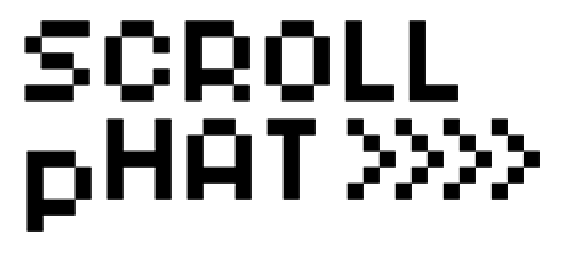

11x5 pixels of single-colour, message scrolling goodness!

https://shop.pimoroni.com/products/scroll-phat

#Installing

We've created a super-easy installation script that will install all pre-requisites and get your Scroll pHAT up and running in a jiffy. To run it fire up Terminal which you'll find in Menu -> Accessories -> Terminal on your Raspberry Pi desktop like so:


In the new terminal window type the following and follow the instructions:

```bash
curl -sS https://get.pimoroni.com/scrollphat | bash
```

If you choose to download examples you'll find them in `/home/pi/Pimoroni/scrollphat`, but you can also check out the examples in this repo: [examples](examples)

# Resetting

To turn off all the LEDs, run the turn_leds_off.py script, or in Python:

```python
import scrollphat
scrollphat.clear()
```
